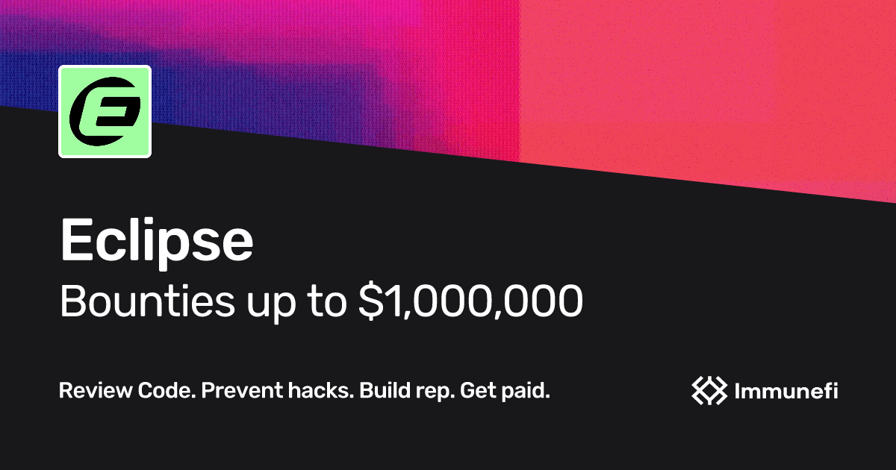

# Eclipse Bug Bounty Program

## Eclipse x Immunefi

We’re excited to announce the launch of Eclipse's Bug Bounty Program on Immunefi!&#x20;

Solana on Ethereum enables developers to build with ease while scaling and delivering exceptional user experiences. We offer the speed of Solana coupled with the liquidity and security of Ethereum. Eclipse’s mission is to create a fast, scalable, and secure L2 on Ethereum, leveraging the Solana Virtual Machine to deliver the most performant execution environment in crypto.&#x20;

Security has always been a priority for Eclipse, and to ensure the safety of our ecosystem, Eclipse has chosen to launch this comprehensive bug bounty program. With a maximum bounty of $1,000,000, the program offers an incredible opportunity for skilled security researchers to contribute to the protection of Eclipse's users and assets.

<figure><figcaption></figcaption></figure>


Bug Submission Page


## Rewards and Severity Levels

Eclipse’s reward system is designed to reflect the impact of vulnerabilities:

* **Critical vulnerabilities**: Up to $1,000,000 (minimum of $25,000), depending on the funds at risk.
* **High vulnerabilities**: $5,000 to $25,000, with rewards increasing for extended impact (e.g., temporary freezing of funds).
* **Medium vulnerabilities**: $5,000.
* **Low vulnerabilities**: $1,000.

Security researchers who participate will be rewarded based on the severity of the vulnerabilities found, with payouts denominated in USDC on Ethereum. As with all programs on Immunefi, Eclipse follows the Immunefi Vulnerability Severity Classification System (V2.3) to determine the reward amounts. You can find more detailed information on how to participate [here](https://immunefi.com/bug-bounty/eclipse/information/).
