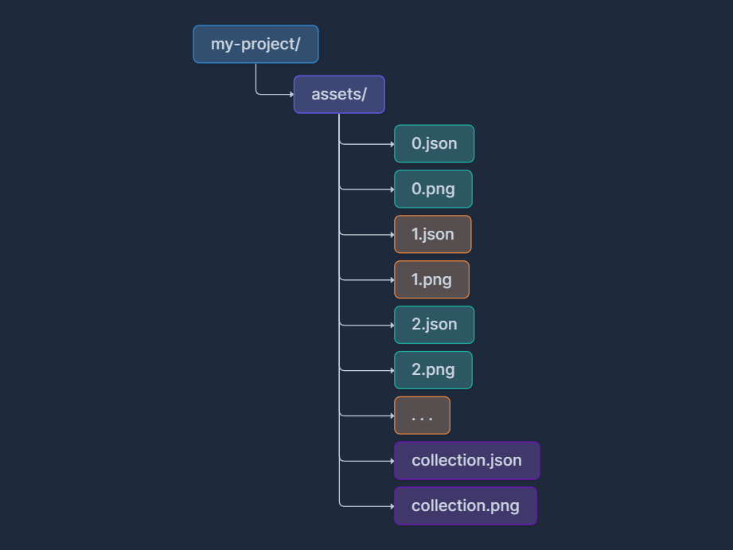

# Metaplex

## Intro

The Metaplex Protocol is a decentralized protocol at the center of Solana and the SVM ecosystem, designed to facilitate the creation, sale, and management of digital assets. It is the preferred platform for digital asset creation and management on Eclipse, offering tools and standards for developers, creators and businesses to build decentralized applications. Known for powering digital assets including NFTs, fungible tokens, RWAs, gaming assets, DePIN assets and more, Metaplex is one of the most widely used blockchain protocols and developer platforms, with over 550 million assets minted across 55 million unique wallets.

## Metaplex Core

Metaplex Core is the protocol powering the next generation of digital assets on Eclipse. It’s already been adopted by all major dApps and protocols for creating the next wave of NFTs. Metaplex Core offers all of the functionality of the previous Token Metadata standard and more, all while improving efficiency and cost by an order of magnitude.

Core supports the creation of Token Metadata features such as Editions and Royalties enforcement, while also enabling new functionality through its novel Plugin system. The Plugin system creates a common interface that allows additional features to be added to an asset dynamically, even going so far as to allow third party integrations installed directly to NFTs. Popular plugins include Royalty, Attributes, Autograph, and more!

The Core protocol utilizes a single account design that allows it to achieve the smallest onchain footprint, reducing the overall rent cost to the smallest possible amount. This compact, single account also allows the protocol to abstract away many of the complexities of SVM by utilizing its advanced Plugin system, allowing users to have all of the flexibility of a custom protocol without having to develop a new program.

<details>

<summary><strong>More information and details on developing with Metaplex Core can be found below:</strong></summary>

Official Metaplex Core Documentation:\
[https://developers.metaplex.com/core](https://developers.metaplex.com/core)\
[https://www.npmjs.com/package/@metaplex-foundation/mpl-core](https://www.npmjs.com/package/@metaplex-foundation/mpl-core)\
[https://docs.rs/mpl-core/latest/mpl\_core/](https://docs.rs/mpl-core/latest/mpl_core/)

</details>

***

## Metaplex Token Metadata

The Token Metadata protocol by Metaplex is the de facto standard for NFTs and Fungible Tokens on Solana and across all SVMs. It offers the widest level of support by SVM dApps and protocols. It is built on the SPL-Token and SPL-Token-2022 token programs. The Token Metadata program supports a wide array of Token Standards depending on the requirements of the creator.

### Non-Fungible Tokens

Token Metadata offers a basic standard for supporting non-fungible digital assets, allowing users to create onchain art, PFPs, or other singular assets. It supports common functionality such as delegation, sales, owned escrow (e.g. ERC-6551 equivalent) and more.

### Programmable Non-Fungible Tokens

All of the same functionality of Non-Fungible Tokens with additional programmability and royalty enforcement. Programmable NFTs support attaching a ruleset to an NFT that can prevent the asset from being sold or delegated to malicious platforms, marketplaces that don’t support royalties, and more.

### Fungible Tokens

Metadata can easily be attached to SPL-Tokens using the Token Metadata program to make Fungible or Semi-Fungible tokens. The Token Metadata program attaches a Metadata account to fungible assets in a way that’s recognized and readable across dApps and protocols.

### Editions

Token Metadata also includes the ability to print editions, commonly used for 1/1 or prints of artwork. The protocol utilizes a Master Edition NFT that can have derivative artworks printed off as numbered edition copies.

<details>

<summary><strong>More information and details on developing with Token Metadata can be found below:</strong></summary>

[https://developers.metaplex.com/token-metadata\
https://www.npmjs.com/package/@metaplex-foundation/mpl-token-metadata\
https://docs.rs/mpl-token-metadata/latest/mpl\_token\_metadata/\
](https://developers.metaplex.com/token-metadatahttps://www.npmjs.com/package/@metaplex-foundation/mpl-token-metadatahttps://docs.rs/mpl-token-metadata/latest/mpl_token_metadata/)

</details>

***

## Metaplex Candy Machine

The Metaplex Candy Machine protocol is the simplest way to deploy and launch NFT collections on the SVM. It works by deploying a lazy-minting protocol that stores the asset data for an entire collection and allows minters to mint assets from the collection. Candy Machine supports a wide array of “Guards” which offer a range of conditions that must first be met in order to mint an asset from the collection.

Popular Guards include Sol Payment, which represents the sale price; Token Gate, which can be used to gate the collection to an allowlist token mint; Token Payment, which allows payment in a custom token of the creator’s choosing; Start Date, which establishes the start time of the sale. Candy Machine currently supports over 20 guards with more being added regularly!

<details>

<summary><strong>More information and details on launching with Candy Machine can be found below:</strong></summary>

Token Metadata Launches: ​​[https://developers.metaplex.com/candy-machine](https://developers.metaplex.com/candy-machine)

Metaplex Core Launches: [https://developers.metaplex.com/core-candy-machine](https://developers.metaplex.com/core-candy-machine)

</details>

***

## Metaplex Bubblegum

The Bubblegum program by Metaplex utilizes Metaplex state compression to mint cNFTs in a compressed format. This allows for unprecedented cost efficiency while still providing all of the benefits that come with SVM digital assets: Aura, Metaplex SDKs, Metaplex support, etc.

The cNFT standard is based on the Metaplex Token Metadata NFT standard and contains similar fields on each asset. Compressed NFTs are aggregated in a Merkle tree stored on chain which enables assets to be aggregated and stored as a single Merkle root hash, minimizing the amount of rent required for storage. Detailed asset data can be easily obtained from Metaplex Aura.

<details>

<summary><strong>More information and details on developing with Bubblegum can be found below:</strong></summary>

[https://developers.metaplex.com/bubblegum\
https://www.npmjs.com/package/@metaplex-foundation/mpl-bubblegum\
https://docs.rs/mpl-bubblegum/latest/mpl\_bubblegum/\
](https://developers.metaplex.com/bubblegumhttps://www.npmjs.com/package/@metaplex-foundation/mpl-bubblegumhttps://docs.rs/mpl-bubblegum/latest/mpl_bubblegum/)

</details>

***

## MPL-404

MPL-404 is a hybrid model for digital assets, web3 games, and onchain communities. At the core of the model is a swap program (mpl-hybrid) that trades a fixed number of fungible assets for a non-fungible asset and vice versa. The swap is a dual escrow system, ensuring that all available non-fungible assets are backed by escrowed fungibles and vice versa.

Swaps allow for instant asset liquidity for NFTs and personalization and rarity gamification for tokens. The program is used by both memecoins and existing NFT communities for digital asset swapping and unique features such as metadata reroll and randomization.

<details>

<summary><strong>More information and details on developing with MPL-404 can be found below:</strong></summary>

[https://developers.metaplex.com/mpl-hybrid\
https://www.npmjs.com/package/@metaplex-foundation/mpl-hybrid\
https://docs.rs/mpl-hybrid/latest/mpl\_hybrid/\
](https://developers.metaplex.com/mpl-hybridhttps://www.npmjs.com/package/@metaplex-foundation/mpl-hybridhttps://docs.rs/mpl-hybrid/latest/mpl_hybrid/)

</details>

***

## Metaplex Core - JavaScript Client&#x20;

Metaplex provides a JavaScript library that can be used to interact with Core Assets. Thanks to the [Umi framework](https://github.com/metaplex-foundation/umi), it ships without many opinionated dependencies thus providing a lightweight library that can be used in any JavaScript project.

To get started you'll need to install the Umi Framework and the Core JavaScript Library.

### Umi Installation

To use Umi you need to install Umi and all the external plugins you'll want to use. Alternatively, if you don't need a specific plugin, you can install the default bundle that includes a set of plugins that's suitable for most use cases.


**Note**: since the default bundle relies on web3.js for some of the interfaces you'll need to install that package as well.


#### Required Packages:

The following are the required packages that must be installed to use Umi:

```javascript
npm i @metaplex-foundation/umi
```

```javascript
npm i @metaplex-foundation/umi-bundle-defaults
```

```javascript
npm i @solana/web3.js
```

#### For library authors: <a href="#for-library-authors" id="for-library-authors"></a>

Library authors, that want to use Umi's interfaces to drastically reduce their dependencies, will only need to install the main Umi library. It is highly recommended to install it as a peer dependency to ensure the end-user does not end up with multiple versions of the Umi library using the following command:

```javascript
npm i @metaplex-foundation/umi --save-peer
```

#### For testing: <a href="#for-testing" id="for-testing"></a>

Also note that Umi comes with a testing bundle that can help both end-users and library authors to test their code. For instance, it includes a `MockStorage` implementation used for both the `UploaderInterface` and the `DownloaderInterface` so you can reliably test your code without having to rely on a real storage provider.

```javascript
npm i @metaplex-foundation/umi
```

```
npm i @metaplex-foundation/umi-bundle-tests
```

### Core JavaScript Library Installation

You can install the mpl-core library with the following command:

```
npm install @metaplex-foundation/mpl-core
```

### Initialization

Next, we will import both libraries and create an `Umi` instance for Eclipse Mainnet:

```javascript
import { createUmi } from '@metaplex-foundation/umi-bundle-defaults'
import { mplCore } from '@metaplex-foundation/mpl-core'

// Use the RPC endpoint of your choice.
const umi = createUmi('https://mainnetbeta-rpc.eclipse.xyz').use(mplCore())
```

Then instruct Umi which wallet to use. You can **create a new wallet** for testing, **import an existing wallet** from the filesystem, or **use a walletAdapter** for web-based dApps.

#### From a New Wallet:

```javascript
import { createUmi } from '@metaplex-foundation/umi-bundle-defaults'
import { generateSigner, signerIdentity } from '@metaplex-foundation/umi'

const umi = createUmi('https://mainnetbeta-rpc.eclipse.xyz')

// Generate a new keypair signer.
const signer = generateSigner(umi)

// Tell Umi to use the new signer.
umi.use(signerIdentity(signer))
```

#### From an Existing Wallet saved using a File System:

```javascript
import * as fs from "fs";
import * as path from "path";
import { createUmi } from '@metaplex-foundation/umi-bundle-defaults'
import { createSignerFromKeypair, signerIdentity } from '@metaplex-foundation/umi'

const umi = createUmi('https://mainnetbeta-rpc.eclipse.xyz')

// Use fs to navigate the filesystem till you reach
// the wallet you wish to use via relative pathing.
const walletFile = fs.readFileSync(
  path.join(__dirname, './keypair.json')
)

// Usually Keypairs are saved as Uint8Array, so you  
// need to transform it into a usable keypair.  
let keypair = umi.eddsa.createKeypairFromSecretKey(new Uint8Array(walletFile));

// Before Umi can use this Keypair you need to generate 
// a Signer type with it.  
const signer = createSignerFromKeypair(umi, keypair);

// Tell Umi to use the new signer.
umi.use(signerIdentity(walletFile))
```

#### From an Existing Wallet saved using Solana Wallet Adapter:

```javascript
import { createUmi } from '@metaplex-foundation/umi-bundle-defaults'
import { walletAdapterIdentity } from '@metaplex-foundation/umi-signer-wallet-adapters'
import { useWallet } from '@solana/wallet-adapter-react'

const wallet = useWallet()

const umi = createUmi('https://mainnetbeta-rpc.eclipse.xyz')

// Register Wallet Adapter to Umi
umi.use(walletAdapterIdentity(wallet))
```


**Note**: The `walletAdapter` section provides only the code needed to connect it to Umi, assuming you've already installed and set up the `walletAdapter`. For a comprehensive guide, refer to this [guide](https://github.com/anza-xyz/wallet-adapter/blob/master/APP.md)

\
The **Umi** interface stores two instances of **Signer**: The **identity** using the app and the **payer** paying for transaction and storage fees. By default, the `signerIdentity` method will also update the **payer** attribute since, in most cases, the identity is also the payer.

If you want to learn more, go to the [Umi Context Interfaces Paragraph](https://developers.metaplex.com/umi/interfaces#the-context-interface)


### Creating Assets

You can now interact with Core Assets and Core Collections by using [the various functions provided by the library](https://mpl-core.typedoc.metaplex.com/) and passing your `Umi` instance to them. Here's an example of creating an Asset:

```javascript
const result = createV1(umi, {
  asset: asset,
  name: 'My Nft',
  uri: 'https://example.com/my-nft',
}).sendAndConfirm(umi)
```

### Fetch a Single Asset

To fetch the data of your newly created asset you can use:

```javascript
import { fetchAssetV1 } from '@metaplex-foundation/mpl-core'

const asset = await fetchAssetV1(umi, asset.publicKey)

console.log(asset)
```

***

## Metaplex Core - Rust

If you are a Rust developer, you can also use a Rust client SDK to interact with the Token Metadata program. Metaplex provides a dedicated Rust client crate, which is a lightweight crate with minimal dependencies.

To get started, you'll need to add the `mpl-token-metadata` dependency to your project. From a terminal on the root folder of your project:

```rust
cargo add mpl-token-metadata
```

### Structure

The client SDK is divided into several modules:

* `accounts`: structs representing the accounts of the program
* `errors`: enum representing program errors
* `instructions`: structs to facilitate the creation of instructions from client (off-chain) and programs (onchain), and instruction arguments
* `types`: structs representing types used by the program

A good starting point to explore is the `instructions` module, which contains helpers to create instructions to interact with Token Metadata. These are designed to be flexible and easy-to-use. If an instruction requires additional types, these will be referenced from the `types` module. If you want to deserialize the content of a Token Metadata account, the `accounts` module has a struct representing each account with helpers methods to deserialize their content.

### Instruction Builders <a href="#instruction-builders" id="instruction-builders"></a>

One of the main features of the client SDK is to facilitate the creation of instructions. There are two _types_ of instruction builders depending on whether you are writing off-chain or onchain code, and both support passing accounts by name and optional positional accounts.

#### Client (off-chain) <a href="#client-off-chain" id="client-off-chain"></a>

These are intended to be used by off-chain client code. Each instruction is represented by a struct, where its fields are the `Pubkey`s of the required accounts.

`CreateV1` instruction code:

```rust
pub struct CreateV1 {
    /// Unallocated metadata account with address as pda
    /// of ['metadata', program id, mint id]
    pub metadata: Pubkey,

    /// Unallocated edition account with address as pda
    /// of ['metadata', program id, mint, 'edition']
    pub master_edition: Option<Pubkey>,

    /// Mint of token asset
    pub mint: (Pubkey, bool),

    /// Mint authority
    pub authority: Pubkey,

    /// Payer
    pub payer: Pubkey,

    /// Update authority for the metadata account
    pub update_authority: (Pubkey, bool),

    /// System program
    pub system_program: Pubkey,

    /// Instructions sysvar account
    pub sysvar_instructions: Pubkey,

    /// SPL Token program
    pub spl_token_program: Pubkey,
}
```

After filling in the instruction account fields, you can use the `instruction(...)` method to generate the corresponding `Instruction`:

```rust
// instruction args
let args = CreateV1InstructionArgs {
    name: String::from("My pNFT"),
    symbol: String::from("MY"),
    uri: String::from("https://my.pnft"),
    seller_fee_basis_points: 500,
    primary_sale_happened: false,
    is_mutable: true,
    token_standard: TokenStandard::ProgrammableNonFungible,
    collection: None,
    uses: None,
    collection_details: None,
    creators: None,
    rule_set: None,
    decimals: Some(0),
    print_supply: Some(PrintSupply::Zero),
};

// instruction accounts
let create_ix = CreateV1 {
    metadata,
    master_edition: Some(master_edition),
    mint: (mint_pubkey, true),
    authority: payer_pubkey,
    payer: payer_pubkey,
    update_authority: (payer_pubkey, true),
    system_program: system_program::ID,
    sysvar_instructions: solana_program::sysvar::instructions::ID,
    spl_token_program: spl_token::ID,
};

// creates the instruction
let create_ix = create_ix.instruction(args);
```

At this point, `create_ix` is an `Instruction` ready to be added to a transaction and sent for processing.

In the example above, you probably noticed that even when we do not need to provide a value for an optional argument, we still need to specify `None`. To facilitate the creation of instructions even further, you can use the `*Builder` _companion_ struct.

Creating an `Instruction` using `CreateV1Builder`:

```rust
let create_ix = CreateV1Builder::new()
    .metadata(metadata)
    .master_edition(Some(master_edition))
    .mint(mint_pubkey, true)
    .authority(payer_pubkey)
    .payer(payer_pubkey)
    .update_authority(payer_pubkey, true)
    .is_mutable(true)
    .primary_sale_happened(false)
    .name(String::from("My pNFT"))
    .uri(String::from("https://my.pnft"))
    .seller_fee_basis_points(500)
    .token_standard(TokenStandard::ProgrammableNonFungible)
    .print_supply(PrintSupply::Zero)
    .instruction();
```

The end result is the same `create_ix` instruction to be added to a transaction and sent for processing.

#### Cross Program Invocation (onchain):

When you are writing a program that needs to interact with Token Metadata, you can use the onchain Cross Program Invocation (CPI) builder. They work similarly to off-chain builders, with the main difference being that they expect `AccountInfo` references instead of `Pubkey`.&#x20;

`TransferV1Cpi` instruction struct:

```rust
pub struct TransferV1Cpi<'a> {
    /// The program to invoke.
    pub __program: &'a AccountInfo<'a>,

    /// Token account
    pub token: &'a AccountInfo<'a>,

    /// Token account owner
    pub token_owner: &'a AccountInfo<'a>,

    /// Destination token account
    pub destination_token: &'a AccountInfo<'a>,

    /// Destination token account owner
    pub destination_owner: &'a AccountInfo<'a>,

    /// Mint of token asset
    pub mint: &'a AccountInfo<'a>,

    /// Metadata (pda of ['metadata', program id, mint id])
    pub metadata: &'a AccountInfo<'a>,

    /// Edition of token asset
    pub edition: Option<&'a AccountInfo<'a>>,

    /// Owner token record account
    pub token_record: Option<&'a AccountInfo<'a>>,

    /// Destination token record account
    pub destination_token_record: Option<&'a AccountInfo<'a>>,

    /// Transfer authority (token owner or delegate)
    pub authority: &'a AccountInfo<'a>,

    /// Payer
    pub payer: &'a AccountInfo<'a>,

    /// System Program
    pub system_program: &'a AccountInfo<'a>,

    /// Instructions sysvar account
    pub sysvar_instructions: &'a AccountInfo<'a>,

    /// SPL Token Program
    pub spl_token_program: &'a AccountInfo<'a>,

    /// SPL Associated Token Account program
    pub spl_ata_program: &'a AccountInfo<'a>,

    /// Token Authorization Rules Program
    pub authorization_rules_program: Option<&'a AccountInfo<'a>>,

    /// Token Authorization Rules account
    pub authorization_rules: Option<&'a AccountInfo<'a>>,

    /// The arguments for the instruction.
    pub __args: TransferV1InstructionArgs,
}
```

The instruction struct requires three different pieces of information: (1) the program to CPI into it – `__program` field; (2) a variable list of accounts represented by references to `AccountInfo`; (3) the instruction args – `__args` field. To simplify the creation of the struct, there is a `new(...)` factory method. After filling in the program, instruction accounts and argument fields, you can use the `invoke()` or `invoke_signed(...)` method to perform the CPI.

Invoking the `TransferV1Cpi` instruction:

```rust
// creates the instruction
let cpi_transfer = TransferV1Cpi::new(
    metadata_program_info,
    TransferV1CpiAccounts {
        token: owner_token_info,
        token_owner: owner_info,
        destination_token: destination_token_info,
        destination_owner: destination_info,
        mint: mint_info,
        metadata: metadata_info,
        authority: vault_info,
        payer: payer_info,
        system_program: system_program_info,
        sysvar_instructions: sysvar_instructions_info,
        spl_token_program: spl_token_program_info,
        spl_ata_program: spl_ata_program_info,
        edition: edition_info,
        token_record: None,
        destination_token_record: None,
        authorization_rules: None,
        authorization_rules_program: None,
    },
    TransferV1InstructionArgs {
        amount,
        authorization_data: None,
    },
);

// performs the CPI
cpi_transfer.invoke_signed(&[&signer_seeds])
```

You have probably noticed (again) that for every optional account/argument that we do not pass a value, we still need to set it to `None`. Similarly to the off-chain instructions, CPI instructions have a _companion_ `*Builder` struct.

Invoking the `TransferV1Cpi` instruction using `TransferV1CpiBuilder`:

```rust
// creates the instruction
let cpi_transfer = TransferV1CpiBuilder::new(metadata_program_info)
    .token(owner_token_info)
    .token_owner(owner_info)
    .destination_token(destination_token_info)
    .destination_owner(destination_info)
    .mint(mint_info)
    .metadata(metadata_info)
    .edition(edition_info)
    .authority(vault_info)
    .payer(payer_info)
    .system_program(system_program_info)
    .sysvar_instructions(sysvar_instructions_info)
    .spl_token_program(spl_token_program_info)
    .spl_ata_program(spl_ata_program_info)
    .amount(amount);

// performs the CPI
cpi_transfer.invoke_signed(&[&signer_seeds])
```

### PDA Helpers

Another set of useful helpers of the SDK are the PDA lookups. Account types representing PDAs (e.g., `Metadata`) have associated functions to find/create PDA `Pubkey`.

Implementation of `find_pda` and `create_pda` helper methods:

```rust
impl Metadata {
    pub fn find_pda(mint: Pubkey) -> (Pubkey, u8) {
        Pubkey::find_program_address(
            &[
                "metadata".as_bytes(),
                crate::MPL_TOKEN_METADATA_ID.as_ref(),
                mint.as_ref(),
            ],
            &crate::MPL_TOKEN_METADATA_ID,
        )
    }

    pub fn create_pda(
        mint: Pubkey,
        bump: u8,
    ) -> Result<Pubkey, PubkeyError> {
        Pubkey::create_program_address(
            &[
                "metadata".as_bytes(),
                crate::MPL_TOKEN_METADATA_ID.as_ref(),
                mint.as_ref(),
                &[bump],
            ],
            &crate::MPL_TOKEN_METADATA_ID,
        )
    }
}
```

The `find_pda` method is usually used on off-chain clients:

```rust
let (metadata_pubkey, _) = Metadata::find_pda(mint);
```

The `create_pda` method is recommended to be used onchain, since it can save compute units in comparison to `find_pda`, but it does require storing the `bump` used to generate the PDA derivation:

```rust
let metadata_pubkey = Metadata::create_pda(mint, bump)?;
```

***

## Metaplex Candy Machine

The Metaplex Candy Machine protocol is the simplest way to deploy and launch NFT collections on the SVM. It works by deploying a lazy-minting protocol that stores the asset data for an entire collection and allows minters to mint assets from the collection. Candy Machine supports a wide array of “Guards” which offer a range of conditions that must first be met in order to mint an asset from the collection.

Popular Guards include **Payment**, which represents the sale price; Token Gate, which can be used to gate the collection to an allowlist token mint; Token Payment, which allows payment in a custom token of the creator’s choosing; Start Date, which establishes the start time of the sale. Candy Machine currently supports over 20 guards with more being added regularly.


Official Candy Machine documentation: [https://developers.metaplex.com/candy-machine](https://developers.metaplex.com/candy-machine)


### Candy Machine - Javascript

Metaplex provides a JavaScript library that can be used to interact with Candy Machines. Thanks to the Umi framework, it ships without many opinionated dependencies and, thus, provides a lightweight library that can be used in any JavaScript project.

To get started, you'll need to install the Umi framework and the Candy Machine JavaScript library:

```javascript
npm install \
  @metaplex-foundation/umi \
  @metaplex-foundation/umi-bundle-defaults \
  @solana/web3.js \
  @metaplex-foundation/mpl-candy-machine
```

Next, you may create your `Umi` instance and install the `mplCandyMachine` plugin:

```javascript
import { createUmi } from '@metaplex-foundation/umi-bundle-defaults'
import { mplCandyMachine } from '@metaplex-foundation/mpl-candy-machine'

// Use the RPC endpoint of your choice.
const umi = createUmi('https://mainnetbeta-rpc.eclipse.xyz').use(mplCandyMachine())
```

Then you want to tell Umi which wallet to use. Please see the previous [section](metaplex.md#initialization).

That's it, you can now interact with NFTs by using [the various functions provided by the library](https://mpl-candy-machine.typedoc.metaplex.com/) and passing your `Umi` instance to them. Here's an example of fetching a candy machine account and its associated candy guard account.

```javascript
import { publicKey } from '@metaplex-foundation/umi'
import {
  fetchCandyMachine,
  fetchCandyGuard,
} from '@metaplex-foundation/mpl-candy-machine'

const candyMachinePublicKey = publicKey('...')
const candyMachine = await fetchCandyMachine(umi, candyMachinePublicKey)
const candyGuard = await fetchCandyGuard(umi, candyMachine.mintAuthority)
```

### Candy Machine - Rust

If you are a Rust developer, you can also use a Rust crate to interact with the Candy Machine program. Since the program is written in Rust, this crate contains all the program's logic, including helper methods that prepare instructions for us.

This can be helpful if you are developing a Rust client or if you want to make [CPI calls](https://solanacookbook.com/references/programs.html#how-to-do-cross-program-invocation) to the Candy Machine program within your program.

Since candy machines are composed of two programs, you will need to install two libraries.

* **Candy Machine Core**
  * [GitHub Repository](https://github.com/metaplex-foundation/mpl-candy-machine/tree/main/programs/candy-machine-core)
  * [Crate Page](https://crates.io/crates/mpl-candy-machine-core)
  * [API References](https://docs.rs/mpl-candy-machine-core/0.1.0/mpl_candy_machine_core/)
* **Candy Guard**
  * [GitHub Repository](https://github.com/metaplex-foundation/mpl-candy-machine/tree/main/programs/candy-guard)
  * [Crate Page](https://crates.io/crates/mpl-candy-guard)
  * [API References](https://docs.rs/mpl-candy-guard/0.1.0/mpl_candy_guard/)

### Candy Machine - Sugar

To get started, first check that you have Sugar installed on your system:

```
sugar --version
```

The command above should print the Sugar version – e.g., `sugar-cli 2.5.0`.

By default, Sugar uses the keypair and RPC settings from `solana-cli`. You can check your current settings by running:

```
solana config get
```

And you can set different settings by running:

```
solana config set --url <rpc url> --keypair <path to keypair file>
```


Sugar does not require `solana-cli` to be installed on the system. Every command in Sugar accept the flags `-k` (keypair) and `-r` (RPC) to configure the values to use.


#### Preparing Your Files

Create a folder for your project and within it, create a folder named `assets` to store your json metadata and image file pairs with the naming convention `0.json`, `0.png`, `1.json`, `1.png`, and so on. The metadata extension is `.json` and the image files can be `.png`, `.gif`, `.jpg` and `.jpeg`. Additionally, you will need `collection.json` and `collection.png` files containing the information for your collection NFT.

Your project directory will then look like:

<figure><figcaption></figcaption></figure>

#### Running Sugar

Within your project directory, use the `launch` command to start an interactive process of creating your config file and deploying a Candy Machine to Solana:

```
sugar launch
```

At the end of the execution of the launch command, a Candy Machine will be deployed onchain. You can use the `mint` command to mint an NFT:

```
sugar mint
```

When all NFTs have been minted, you can close your Candy Machine and reclaim the account rent:

```
sugar withdraw
```


The `withdraw` command will close the Candy Machine even if it is not empty, so use it with caution.


***

## Metaplex Core Candy Machine

The Metaplex Protocol **Candy Machine** is the leading minting and distribution program for fair NFT collection launches on SVM chains. With the introduction of the `Metaplex Core Protocol` simplifying the NFT process, it was only fitting for a Core edition of the Candy Machine to come to the masses. Much like its name suggests, you can think of a Candy Machine as a temporary structure which is first loaded by creators and then unloaded by buyers. It allows creators to bring their digital assets onchain in a secure and customisable way.


Official Core Candy Machine documentation: [https://developers.metaplex.com/core-candy-machine](https://developers.metaplex.com/core-candy-machine)


### Core Candy Machine - Javascript

Metaplex provides a JavaScript library that can be used to interact with the Core Candy Machine program. Thanks to the Umi framework, it ships without many opinionated dependencies and, thus, provides a lightweight library that can be used in any JavaScript project.

To get started, you'll need to install the Umi framework and the Core Candy Machine JavaScript library:

```javascript
npm install \
  @metaplex-foundation/umi \
  @metaplex-foundation/umi-bundle-defaults \
  @metaplex-foundation/mpl-core-candy-machine
```

Next, you may create your `Umi` instance and install the `mplCore` plugin like so:

```javascript
import { createUmi } from '@metaplex-foundation/umi-bundle-defaults'
import { 
  mplCandyMachine as mplCoreCandyMachine 
} from "@metaplex-foundation/mpl-core-candy-machine";

// Use the RPC endpoint of your choice.
const umi = createUmi('https://mainnetbeta-rpc.eclipse.xyz').use(mplCoreCandyMachine())
```

Then you want to tell Umi which wallet to use. Please see the previous [section](metaplex.md#initialization).

That's it, you can now start interacting with the `Core Candy Machine` program.

### Core Candy Machine - Rust

Metaplex provides a Rust library that can be used to interact with the Core Candy Machine program on both a client and program level.

To get started, you'll need to [install the Core Candy Machine Crate](https://crates.io/crates/mpl-core-candy-machine-core/).

```
cargo add mpl-core-candy-machine-core
```


**Helpful Links:**

* [Rust Crate](https://crates.io/crates/mpl-core-candy-machine-core/)
* [GitHub Repository](https://github.com/metaplex-foundation/mpl-core-candy-machine)
* [API References](https://docs.rs/mpl-core-candy-machine-core/)

