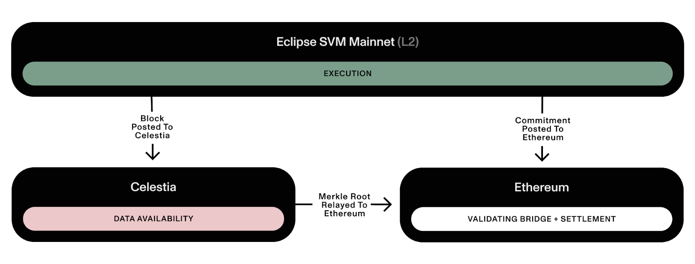

# What is Eclipse Mainnet?

Eclipse Mainnet is Ethereum's first Solana Virtual Machine (SVM) L2. Eclipse Mainnet combines the best pieces of the modular stack:

* **Settlement: Ethereum** - Eclipse will settle to Ethereum (i.e., the enshrined validating bridge will be on Ethereum) and use ETH as its gas token.
* **Execution: Solana Virtual Machine (SVM)** - Eclipse will run the highly performant SVM as its execution environment.
* **Data Availability: Celestia** - Eclipse will post its data to Celestia for scalable data availability (DA).
* **Proving: RISC Zero** - Eclipse will use RISC Zero for ZK proofs of fraud (without intermediate state serialization!).

<figure><figcaption></figcaption></figure>
